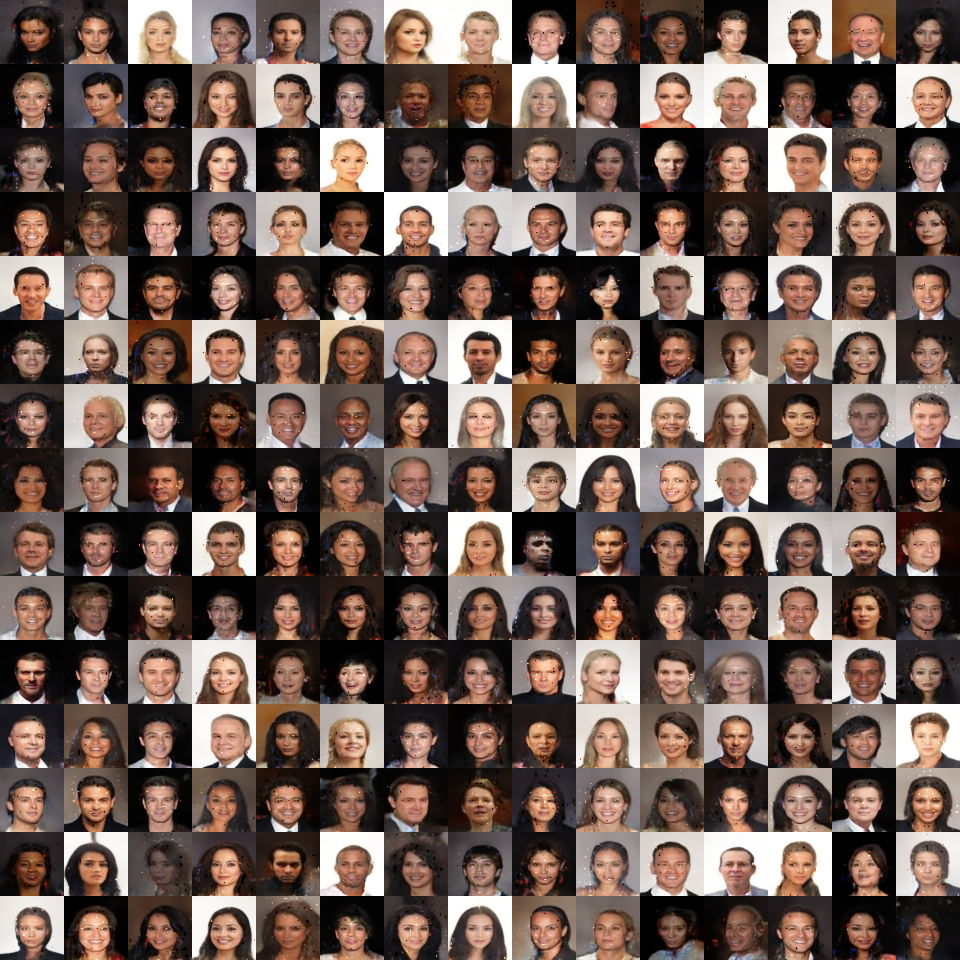

# Boundary Equilibrium Generative Adversarial Network (BEGAN)

This Repository contains an implementation of the [BEGAN](https://arxiv.org/abs/1703.10717) algorithm, using TensorFlow Estimators.

## Prerequisites

* [CelebA](http://mmlab.ie.cuhk.edu.hk/projects/CelebA.html) Dataset
* Dependencies: see Dockerfile

## Results

The model manages to generate good samples of faces, however it tends to suffer from mode-collapses which can partly be seen by the saturated pixels in the image below.

